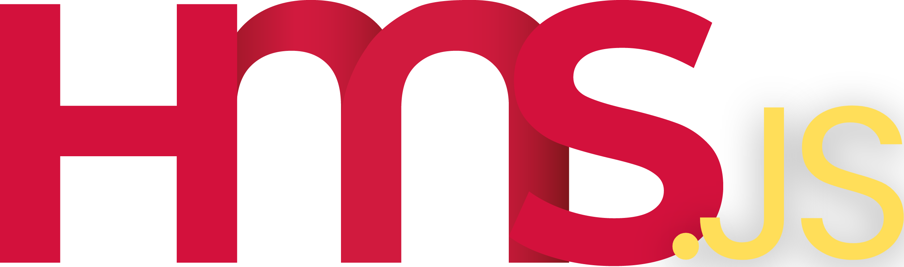

<div align="center">
    <a href="https://hostmyservers.fr"></a>
</div>
<br>
<div align="center">
    <a href="https://www.npmjs.com/package/hostmyservers.js">
        
        
        
    </a>
</div>

### 📦 A modern module for HostMyServers API, streamlining interactions with users, products, and VPS.

## Features
- See and manage your user details 👨‍💻 
- See and manage your products 📦
- Soon: See and manage your VPS 🖥️

## Get my API key 👷
[You can get a free API key of your profile on HMS website!](https://www.hostmyservers.fr/user/api)

## Documentation 📝
[You can access to the documentation on the "wiki" part of the GitHub or by clicking to this link!](https://github.com/FlanZCode/hostmyservers.js/wiki)

## Example 💡
1. First of all, don't forget to install the module!
```bash
npm install hostmyservers.js@latest
```
2. **Enjoy!**
```js
const { HMSClient } = require('hostmyservers.js');

const client = new HMSClient(apiKey);

client.user.getLastName()
  .then(data => console.log(data))
  .catch(error => console.error('Error fetching user details:', error));
```

## Contributing 🤝
1. Fork the original repository by clicking the “Fork” button at the top right of the repository page.

2. Clone your fork locally: `git clone https://github.com/FlanZCode/hostmyservers.js.git`

3. Create a new branch for your changes: `git checkout -b my-new-feature`

4. Make your changes in the code.

5. Commit your changes with a clear message: `git commit -m "Description of my changes"`

6. Push your changes to your fork: `git push origin my-new-feature`

7. Go to your fork’s page on GitHub and click the “New pull request” button.

8. Describe your changes and submit the pull request.

## Credits 🙏
<a href="https://github.com/FlanZCode/hostmyservers.js/graphs/contributors">
  
</a>

## License 📕
This project is licensed under the MIT License. See the LICENSE file for details.